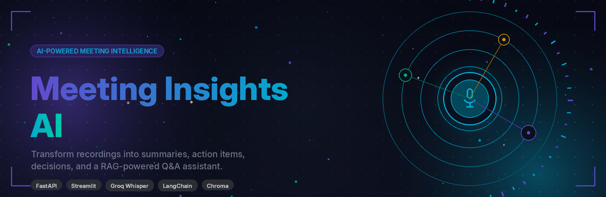
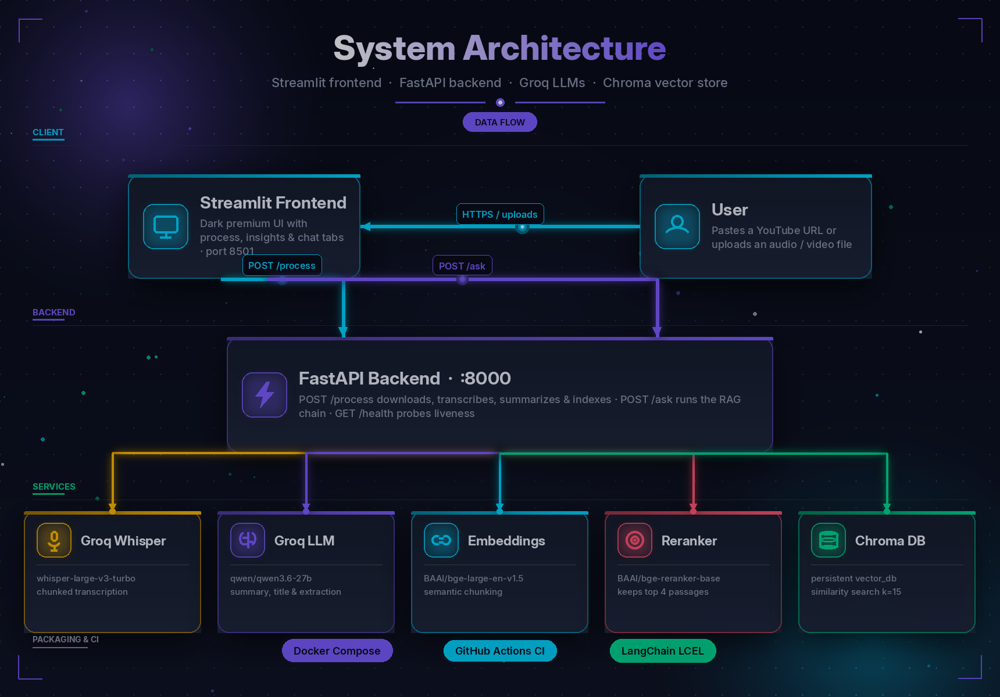
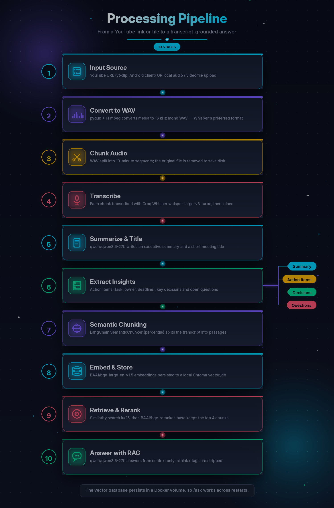
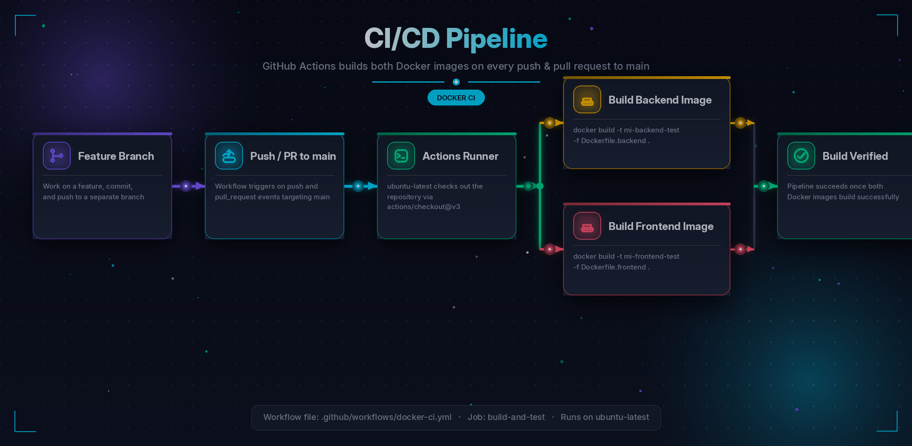

<div align="center">



# 🎙️ Meeting Insights AI

**Turn meeting recordings into summaries, action items, decisions, and an AI Q&A assistant — powered by Whisper, Groq LLMs, and retrieval-augmented generation.**

[](https://www.python.org/)
[](https://fastapi.tiangolo.com/)
[](https://streamlit.io/)
[](https://www.langchain.com/)
[](https://groq.com/)
[](https://www.trychroma.com/)
[](https://www.docker.com/)
[](https://github.com/Muhammad-Mujtaba-Git/Meeting-Insights-AI/actions/workflows/ci-cd.yml)

**[Live Frontend](https://INSERT_YOUR_FRONTEND_URL)** · **[Backend API](https://INSERT_YOUR_BACKEND_URL)** · **[API Docs](https://INSERT_YOUR_BACKEND_URL/docs)**

</div>

---

## 📑 Table of Contents

- [Overview](#-overview)
- [Features](#-features)
- [Tech Stack](#-tech-stack)
- [Architecture](#-architecture)
- [Pipeline](#%EF%B8%8F-pipeline)
- [Project Structure](#-project-structure)
- [Prerequisites](#-prerequisites)
- [Environment Variables](#-environment-variables)
- [Getting Started](#-getting-started)
- [Usage](#-usage)
- [API Reference](#-api-reference)
- [CI/CD](#-cicd)
- [Credits](#-credits)

---

## 🔍 Overview

Meeting Insights AI is a two-part application:

- A **FastAPI backend** that downloads or ingests audio, converts and chunks it, transcribes it with Groq Whisper, uses a Groq LLM to generate a title, summary, action items, key decisions, and open questions, then indexes the transcript in a local Chroma vector store for RAG.
- A **Streamlit frontend** with a dark, premium UI for submitting a YouTube URL or uploaded file, viewing structured insights with KPIs and exports, and asking follow-up questions against the transcript.

The frontend talks to the backend over three HTTP routes: `GET /health`, `POST /process`, and `POST /ask`.

---

## ✨ Features

### Audio ingestion
- Accepts a **YouTube URL** and downloads the best audio stream with `yt-dlp` (using the Android player client), converting it to WAV via the FFmpeg post-processor.
- Accepts a **local file path or browser upload** (`.mp3`, `.wav`, `.m4a`, `.mp4`, `.mkv`, `.aac`, `.flac`, `.ogg`).
- Converts local media to **16 kHz mono WAV** with `pydub` (Whisper's preferred format).
- Splits audio into **10-minute WAV chunks** for transcription, then deletes chunk files after they are transcribed.

### Transcription & analysis
- Transcribes chunks with the **Groq Whisper `whisper-large-v3-turbo`** model.
- Generates an **executive summary** and a short **meeting title**.
- Extracts structured:
  - **Action items** (task, owner, deadline)
  - **Key decisions**
  - **Open / unresolved questions**

### RAG question answering
- Splits the transcript into semantically coherent chunks with LangChain's `SemanticChunker` (percentile breakpoint).
- Embeds chunks with **`BAAI/bge-large-en-v1.5`** and stores them in a persistent **Chroma** database (`vector_db/`).
- Retrieval uses similarity search (`k = 15`) followed by a **`BAAI/bge-reranker-base`** cross-encoder reranker that keeps the top `n = 4` passages.
- Answers are grounded strictly in the retrieved transcript context; the model refuses to answer when the context does not contain the information.

### Frontend
- Three tabs: **Process Meeting**, **Insights**, **Ask Questions**.
- Live progress indicator across the pipeline stages.
- Insights view with KPI cards (action items, decisions, questions, summary word count) and color-coded insight cards.
- One-click downloads for the **summary (TXT)**, **action items (TXT)**, **decisions (TXT)**, and **full JSON**.
- Chat-style Q&A with suggested questions, chat history, and clear-chat control.
- Sidebar configuration for the API base URL and a backend wake-up / status card (for free-tier hosts that sleep after inactivity).
- Strips `<think>…</think>` tags and code-fence markup from reasoning-model output before display.

### Operations
- `GET /health` endpoint for uptime checks and Docker `HEALTHCHECK`.
- CORS enabled for all origins.
- The Chroma database persists in a Docker named volume so Q&A survives container restarts.

---

## 🧰 Tech Stack

| Layer | Technology |
|---|---|
| Frontend | Streamlit, Python 3.11, Requests |
| Backend | FastAPI, Uvicorn, Pydantic Settings, Pydantic v2 |
| Audio | yt-dlp, pydub, FFmpeg |
| Transcription | Groq Whisper (`whisper-large-v3-turbo`) |
| LLM | Groq Chat (`qwen/qwen3.6-27b`) via `langchain-groq` |
| Embeddings | `BAAI/bge-large-en-v1.5` (HuggingFace) |
| Reranker | `BAAI/bge-reranker-base` cross-encoder |
| Chunking | LangChain `SemanticChunker` |
| Vector store | ChromaDB (`langchain-chroma`) |
| Orchestration | LangChain LCEL chains |
| Packaging | Docker, Docker Compose |
| CI | GitHub Actions (Docker image builds) |

---

## 🏗️ Architecture



The Streamlit app runs in the browser but makes its API calls from the Streamlit **server process** using `requests`. In Docker Compose, the frontend reaches the backend over the internal service name `http://backend:8000`.

---

## ⚙️ Pipeline



1. **Input Source** — a YouTube URL (downloaded with `yt-dlp` using the Android player client) or a local audio/video file.
2. **Convert to WAV** — `pydub` + FFmpeg convert the media to 16 kHz mono WAV.
3. **Chunk Audio** — the WAV is split into 10-minute segments; the original file is removed after chunking.
4. **Transcribe** — each chunk is transcribed with Groq Whisper `whisper-large-v3-turbo`, then joined into a full transcript.
5. **Summarize & Title** — `qwen/qwen3.6-27b` produces an executive summary and meeting title.
6. **Extract Insights** — action items (task, owner, deadline), key decisions, and open questions are extracted.
7. **Semantic Chunking** — LangChain `SemanticChunker` (percentile breakpoint) splits the transcript into passages.
8. **Embed & Store** — `BAAI/bge-large-en-v1.5` embeddings are persisted to a local Chroma `vector_db`.
9. **Retrieve & Rerank** — similarity search (`k=15`) is reranked by `BAAI/bge-reranker-base`, keeping the top 4 chunks.
10. **Answer with RAG** — `qwen/qwen3.6-27b` answers from context only; `<think>` tags are stripped.

The vector database persists in a Docker named volume, so `/ask` works across container restarts.

---

## 📁 Project Structure

```text
.
├── app.py                     # Streamlit frontend
├── main.py                    # FastAPI app: /health, /process, /ask
├── config.py                  # Pydantic Settings (environment variables)
├── docker-compose.yml         # Backend + frontend services
├── Dockerfile.backend         # Backend image (python:3.11-slim + ffmpeg)
├── Dockerfile.frontend        # Frontend image (Streamlit)
├── requirements_backend.txt
├── requirements-frontend.txt
├── .env                       # Secrets (not committed)
├── .github/
│   └── workflows/
│       └── docker-ci.yml      # Builds both Docker images on push/PR
├── core/
│   ├── transcribe.py          # Groq Whisper transcription
│   ├── summarize.py           # Summary + title generation
│   ├── extractor.py           # Action items, decisions, questions
│   ├── vector_store.py        # Chroma, embeddings, semantic chunking, reranker
│   └── rag_engine.py          # RAG LCEL chain
├── prompts/
│   └── prompts.py             # Prompt templates for extraction + RAG
├── schema/
│   └── schema.py              # ProcessRequest / QueryRequest models
├── utils/
│   └── audio_processor.py     # yt-dlp download, pydub conversion & chunking
├── uploads/                   # Uploaded media (bind-mounted in Compose)
└── vector_db/                 # Persistent Chroma database (Docker volume)
```

---

## 🧩 Prerequisites

- **Docker** and **Docker Compose** (recommended), **or** Python 3.11 for a local run.
- **FFmpeg** — required by `pydub` and `yt-dlp` for audio conversion. The backend Docker image installs it automatically; on a local host install it via your package manager (e.g. `sudo apt install ffmpeg` or `brew install ffmpeg`).
- A **Groq API key** (get one at [console.groq.com](https://console.groq.com/)).
- **CUDA note:** `core/vector_store.py` configures the embedding model with `model_kwargs={'device': 'cuda'}`. A CUDA-capable GPU is recommended. On a CPU-only host, change `device` to `'cpu'` in that file before running.

---

## 🔐 Environment Variables

Configuration is loaded by `config.py` from a `.env` file (or the shell environment). Create a `.env` file in the project root:

```env
GROQ_API_KEY=your_groq_api_key_here
LANGFUSE_SECRET_KEY=your_langfuse_secret_key_here
LANGFUSE_PUBLIC_KEY=your_langfuse_public_key_here
LANGFUSE_HOST=https://cloud.langfuse.com
```

| Variable | Required | Default | Description |
|---|---|---|---|
| `GROQ_API_KEY` | ✅ | — | API key used for Groq Whisper transcription and the Groq chat LLM. |
| `LANGFUSE_SECRET_KEY` | ✅ | — | Langfuse secret key, as declared in `config.py`. |
| `LANGFUSE_PUBLIC_KEY` | ✅ | — | Langfuse public key, as declared in `config.py`. |
| `LANGFUSE_HOST` | ❌ | `https://cloud.langfuse.com` | Langfuse host URL. |

> ⚠️ The Langfuse keys have no defaults in `config.py`, so they must be present for the backend to start even though their values are not required to exercise the core pipeline.
>
> 🔒 Never commit real `.env` values. The repository's `.gitignore` excludes `.env`.

---

## 🚀 Getting Started

### Option A — Run with Docker Compose (recommended)

1. **Clone the repository**
   ```bash
   git clone https://github.com/INSERT_YOUR_GITHUB_URL.git
   cd INSERT_YOUR_REPO_NAME
   ```

2. **Create your `.env`** file in the project root using the variables above.

3. **Build and start both services**
   ```bash
   docker compose up --build
   ```
   - Backend (FastAPI): <http://localhost:8000> · API docs: <http://localhost:8000/docs>
   - Frontend (Streamlit): <http://localhost:8501>

4. **Point the frontend at the backend.** In the Streamlit sidebar, set **API Base URL** to:
   ```text
   http://backend:8000
   ```
   (Use `http://localhost:8000` if running the frontend outside Docker.)

5. **Stop the stack**
   ```bash
   docker compose down
   ```
   The Chroma database persists in the `vector_db_data` Docker volume.

### Option B — Run locally (without Docker)

1. **Backend**
   ```bash
   python -m venv .venv
   source .venv/bin/activate        # Windows: .venv\Scripts\activate
   pip install -r requirements_backend.txt
   # Make sure ffmpeg is installed and on your PATH
   uvicorn main:app --reload --port 8000
   ```

2. **Frontend** (in a second terminal)
   ```bash
   pip install -r requirements-frontend.txt
   streamlit run app.py
   ```

3. Open <http://localhost:8501> and confirm the sidebar's **API Base URL** is `http://localhost:8000`.

---

## 🖥️ Usage

1. Open the Streamlit app (<http://localhost:8501>).
2. If the backend is sleeping (e.g. on a free-tier host), use the **🌐 Backend Status** card's **⚡ Wake Up Backend** button and wait for the green "Ready" status.
3. On the **🚀 Process Meeting** tab, either:
   - Paste a **YouTube URL**, or
   - **Upload** an audio/video file.
4. Click **⚡ Process Meeting**. The progress bar walks through download → chunking → transcription → summarization → extraction → vectorization.
5. Open the **📋 Insights** tab to review the title, executive summary, action items, key decisions, and open questions, and to download TXT/JSON exports.
6. Open the **💬 Ask Questions** tab to ask follow-up questions. The assistant uses semantic retrieval + cross-encoder reranking against the transcript.

---

## 📡 API Reference

The FastAPI app serves automatic Swagger docs at `/docs`.

### `GET /health`

Lightweight health probe.

**Response — `200 OK`**
```json
{
  "status": "ok",
  "service": "meeting-insights-ai",
  "timestamp": "2026-01-01T12:00:00.000000Z"
}
```

---

### `POST /process`

Downloads/ingests audio, transcribes it, extracts insights, and builds the vector store.

**Request body**
```json
{
  "source": "https://youtube.com/watch?v=...  |  /path/to/meeting.mp3"
}
```

| Field | Type | Description |
|---|---|---|
| `source` | string | **Required.** A YouTube URL (`http://`/`https://`) or an absolute path to a local audio/video file. |

**Response — `200 OK`**
```json
{
  "title": "Q3 Product Roadmap Review",
  "summary": "The team reviewed the Q3 roadmap...",
  "action_items": "1. Task...\n- Owner: ...\n- Deadline: ...",
  "key_decisions": "1. ...",
  "questions": "1. ..."
}
```

**Errors**
- `400` / `500` with a JSON `detail` message if download, transcription, or analysis fails.

---

### `POST /ask`

Answers a question about the most recently processed meeting using RAG.

**Request body**
```json
{
  "question": "What decisions were finalized?"
}
```

| Field | Type | Description |
|---|---|---|
| `question` | string | **Required.** The question to answer from the transcript. |

**Response — `200 OK`**
```json
{
  "question": "What decisions were finalized?",
  "answer": "The team approved the October launch date..."
}
```

**Errors**
- `400` — no meeting has been processed yet (no `vector_db/` exists). Run `/process` first.
- `500` — RAG chain failure, returned as `detail`.

`<think>…</think>` tags from reasoning models are stripped from the answer before it is returned.

---

## 🔄 CI/CD



A GitHub Actions workflow (`.github/workflows/docker-ci.yml`) named **Docker CI Pipeline** runs on every `push` and `pull_request` targeting `main`:

1. **Check out repository** — `actions/checkout@v3`
2. **Build backend image** — `docker build -t mi-backend-test -f Dockerfile.backend .`
3. **Build frontend image** — `docker build -t mi-frontend-test -f Dockerfile.frontend .`

This verifies that both Docker images build successfully. The workflow follows a feature-branch flow: work is done on a branch, pushed, and merged into `main` via a pull request, which triggers the build check.

---

## 👤 Credits

**Muhammad Mujtaba**

<p align="left">
  <a href="https://www.linkedin.com/in/muhammad-mujtaba-ml/"></a>
  <a href="https://github.com/Muhammad-Mujtaba-Git"></a>
  <a href="mailto:mujtabam029@gmail.comL"></a>
</p>

---

<div align="center">

<sub>Built with FastAPI · LangChain · Groq Whisper · Chroma · Streamlit</sub>

</div>
